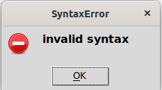
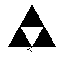

  - [Crédits](#crédits)
  - [Utiliser le mode interactif](#utiliser-le-mode-interactif)
  - [Premiers programmes et premières
    erreurs](#premiers-programmes-et-premières-erreurs)
  - [Etat d’un programme, effets de
    bord](#etat-dun-programme-effets-de-bord)
  - [Utiliser une bibliothèque](#utiliser-une-bibliothèque)

<!-- Définition des hyperliens  -->

# Crédits

*Ce cours est inspiré du chapitre 1 du manuel NSI de la collection
Tortue chez Ellipse, auteurs : Ballabonski, Conchon, Filliatre,
N’Guyen.*

<!-- Définition des hyperliens  -->

# Utiliser le mode interactif

Pour installer sur votre machine l’environnement Idle de programmation
en [Python](https://docs.python.org/3/tutorial/datastructures.html), on
peut le télécharger depuis le site officiel
<https://www.python.org/downloads/>.

Au lycée dans une session Windows, un raccourci sur le bureau doit
permettre de lancer Idle, et dans une session Ubuntu, il suffit d’ouvrir
un terminal de commande avec `CTRL + ALT + T` et de saisir la commande
`idle-python3.x` ou `x` est le numéro de version de
[Python](https://docs.python.org/3/tutorial/datastructures.html) (la
touche de tabulation permet d’obtenir l’autocomplétion après avoir saisi
`idle-python3`).

**Exercice 1**

1.  Écrire les expressions suivantes avec un parenthésage explicite
    permettant d’indiquer l’ordre de priorité des opérations :

<!-- end list -->

``` python
>>> 2 - 3 - 4 
-5
>>> 1 / 2 ** 3
0.125
>>> 1/ 2 / 4
0.125
>>> 1/ 2 * 4
2.0
>>> 2 * 3 ** 2
18
>>> 2 ** 3 ** 2
512
>>> 34 // 3 % 4 
3
>>> 5 % 3 ** 4
5
```

2.  Écrire les expressions suivantes avec le moins de parenthèses
    possibles :

<!-- end list -->

``` python
>>> 2 + (8 * (4 - 5))
>>> (3 - 5) - ((6 * 2) / (5 ** 2)) 
```

**Exercice 2**

Prédire la valeur affichée dans l’interprète
[Python](https://docs.python.org/3/tutorial/datastructures.html) après
les séquences d’instructions suivantes.

1.  Séquence 1 :

<!-- end list -->

``` python
>>> a = 5
>>> a = a + 1
>>> b = a
>>> b = b ** 2 - a
>>> print(b)
```

2.  Séquence 2 :

<!-- end list -->

``` python
>>> a = 5
>>> b = 6
>>> a = a - b
>>> b = b + a
>>> a = b - a
>>> print(a, b)
```

3.  Séquence 3 :

<!-- end list -->

``` python
>>> from random import randint
>>> a = randint(1, 100)  #entier aléatoire entre 1 et 100
>>> b = randint(1, 100)  #entier aléatoire entre 1 et 100
>>> a = a - b
>>> b = b + a
>>> a = b - a
>>> print(a, b)
```

# Premiers programmes et premières erreurs

**Exercice 3**

1.  Dans son espace personnel, créer un répertoire `Chapitre1` avec un
    sous-répertoire `TP1`.
2.  Le prix d’une matière première est de 873 euros la tonne au début de
    l’année. Ce prix subit des variations saisonnières : au premier
    trimestre il augmente de 347 euros, au second trimestre il augmente
    de 25 %, au troisième trimestre il subit une baisse de 50 % et enfin
    il diminue de 100 euros.

<!-- end list -->

  - Créer un nouveau programme avec l’éditeur d’Idle et l’enregistrer
    dans `Chapitre1/TP1` sous le nom `prix.py`.

  - Saisir dans ce fichier le code ci-dessous en le complétant afin
    qu’il calcule les valeurs successives de la variable `prix`.

<!-- end list -->

``` python
prix = 873       #prix au début de l'année
prix = ....      #prix à la fin du premier trimestre
prix = ....      #prix à la fin du second trimestre
prix = ....      #prix à la fin du troisième trimestre
prix = ....      #prix à la fin de l'année
print("Prix final :", prix)
```

**Exercice 4**

La température  en
degrés Fahrenheit s’obtient à partir de la température
 en degrés Celsius par
la formule de conversion .

On veut écrire un programme qui réponde à la **spécification** suivante
: *convertir une mesure de température de l’échelle Celsius vers
l’échelle Fahrenheit.*

1.  Dans l’éditeur d’Idle, créer un programme `temperature.py` et saisir
    le code ci-dessous :

<!-- end list -->

``` python
f = input("Température en degrés Fahrenheit ? "
d = 1,8 * f + 32
print("La température en degrés Celsius est de ", d)
```

2.  Exécuter le code, on doit obtenir un message d’erreur indiquant une
    erreur de Syntaxe. Un curseur indique dans le code la position où
    l’interpréteur
    [Python](https://docs.python.org/3/tutorial/datastructures.html)
    s’est interrompu dans la lecture du code. Si le curseur est en
    début de ligne, il faut souvent chercher l’erreur à la fin de la
    ligne précédente …
    
    Corriger l’erreur de syntaxe.

  

3.  Exécuter de nouveau le code, on doit obtenir un message d’erreur
    indiquant que
    [Python](https://docs.python.org/3/tutorial/datastructures.html) ne
    peut réaliser l’opération demandée. On dit que l’interpréteur
    [Python](https://docs.python.org/3/tutorial/datastructures.html) a
    levé une
    [exception](https://docs.python.org/3.5/tutorial/errors.html).

<!-- end list -->

``` python
TypeError: can only concatenate str (not "int") to str
```

4.  Insérer l’instruction `print(type(f))` en ligne 2, exécuter de
    nouveau. Que représente la valeur affichée avant le message d’erreur
    ?

5.  Remplacer la première instruction par `float(input("Température en
    degrés Fahrenheit ? "))` puis exécuter.
    
    Quel est l’effet de la fonction `float` ? Afficher sa documentation
    dans l’interpréteur avec l’instruction `help(float)`.

6.  Si on teste le programme pour une température de 45 degrés Celsisus
    on doit obtenir l’affichage ci-dessous.
    
    Est-ce que la spécification du programme est vérifiée ? Corriger le
    programme.

<!-- end list -->

``` python
Température en degrés Fahrenheit ? 45
<class 'float'>
La température en degrés Celsius est de  (1, 392.0)
```

À propose des différents types d’erreurs possibles en
[Python](https://docs.python.org/3/tutorial/datastructures.html), on
pourra lire le premier paragraphe de cette page de la documentation
<https://docs.python.org/fr/3.5/tutorial/errors.html>.

# Etat d’un programme, effets de bord

**Exercice 5**

On veut écrire un programme vérifiant la **spécification** suivant : *le
programme doit permuter les valeurs de deux variables `a` et `b` de type
entier saisies en entrée*.

Avec l’éditeur Idle, créer dans le répertoire `TP1` un nouveau programme
`permutation.py` et recopier le code ci-dessous

``` python
# entrées
a = int(input('a ?'))
b = int(input('b ?'))
# traitement
a = b
b = a 
# sorties
print("a = ", a, " et b = ", b)
```

1.  Tester ce programme pour les entrées 605 et 506. La spécification du
    programme est-elle satisfaite ?
2.  Pour représenter l’exécution du programme, compléter le tableau
    d’état ci-dessous, qui affiche pour chaque ligne d’instruction,
    les valeurs des variables `a` et `b` et les éventuelles interactions
    avec l’utilisateur.

| Ligne                              | Variable a | Variable b | Interactions                           |
| ---------------------------------- | ---------- | ---------- | -------------------------------------- |
| a = int ( input ( ‘a ?’ ))         | 734        |            | **affichage :** ‘a ?’ **saisie** : 734 |
| b = int ( input ( ‘b ?’ ))         | 734        | 437        | **affichage :** ‘b ?’ **saisie :** 437 |
| a = b                              |            |            |                                        |
| b = a                              |            |            |                                        |
| print ( “a =” , a, " et b = " , b) |            |            |                                        |

1.  Proposer une modification du programme qui permute les valeurs des
    variables `a` et `b` saisies en entrée.
    
    Démontrer que le programme est correct en complétant un tableau
    d’état de ce nouveau programme qui utilise des valeurs
    indéterminées `x` et `y` pour les variables `a` et `b` en entrée.

2.  Proposer une modification du programme qui permute les valeurs des
    variables `a` et `b` saisies en entrée, sans utiliser de variable
    supplémentaire.

# Utiliser une bibliothèque

**Point de cours 1**

1.  Le coeur du langage
    [Python](https://docs.python.org/3/tutorial/datastructures.html) est
    constitué d’une grammaire, de mots clefs et d’une bibliothèque
    `built-in` rassemblant des instructions qui sont toujours
    disponibles : comme `max, print, abs` etc … Par ailleurs, des
    **bibliothèques**, appelées **modules** en
    [Python](https://docs.python.org/3/tutorial/datastructures.html),
    constituent des boîtes outils d’instructions que le programmeur peut
    réutiliser en important le module. La distribution standard de
    [Python](https://docs.python.org/3/tutorial/datastructures.html) est
    livrée avec un ensemble de modules constituant sa bibliothèque
    standard.

2.  Lorsqu’on a besoin d’utiliser une fonction de bibliothèque, on
    commence par explorer la bibliothèque standard dont les modules sont
    listés et documentés sur le site officiel <https://www.python.org/>.
    Une fois qu’on a déterminé le module qui nous intéresse, par exemple
    `math`, on dispose de plusieurs façons d’importer des instructions :

<!-- end list -->

  - Si on a besoin juste d’une instruction comme `sqrt`, pour la
    fonction racine carrée, on peut écrire avant de l’appeler :

<!-- end list -->

``` python
from math import sqrt
```

  - Si on a besoin de plusieurs instructions, mais en nombre limité,
    comme `sqrt, cos` et `sin`, on peut écrire avant de les appeler :

<!-- end list -->

``` python
from math import sqrt, cos, sin
```

  - Si on a besoin de beaucoup d’instructions du module, on peut
    utiliser le joker `*` et écrire avant de les appeler :

<!-- end list -->

``` python
from math import *
```

Cette méthode peut sembler pratique mais elle est dangereuse si on
importe plusieurs modules, qui contiennent des instructions avec les
mêmes noms. Pour cloisonner les espaces de nommage, on préférera la
méthode suivante.

  - Une autre méthode consiste à importer juste le module, puis on peut
    accéder à chacune des instructions ou constantes qu’il contient en
    les préfixant du nom du module en notation pointée :

<!-- end list -->

``` python
import math
racine3 = math.sqrt(3)
```

Cette méthode alourdit la syntaxe mais permet un meilleur cloisonnement
des noms utilisés par les différents modules utilisés dans un même
programme.

  

Le module graphique `turtle` permet de piloter un «crayon» afin de
tracer dynamiquement des figures géométriques.

Les dessins sont réalisés dans un repère orthonormé virtuel centré sur
la fenêtre d’affichage. L’unité des axes est le pixel. Le repère n’est
pas visible à l’écran.

La forme par défaut du crayon de tracé est une flèche «orientée», placé
au départ à l’origine du repère. Le crayon est situé à la pointe, la
flèche montre le sens du tracé en cours ou à venir.

La liste complète des fonctions disponibles grâce au module turtle est
disponible sur la [documentation
officielle](http://www.frederic-junier.org/PythonSeconde/Python_Seconde_Parc/tortue/doc/turtleDoc.html).
On pourra aussi télécharger un petit résumé au format .pdf en [cliquant
ici](http://www.frederic-junier.org/PythonSeconde/Python_Seconde_Parc/fichiers_python_2nde/Resume_Turtle.pdf).

On donne ci-dessous un exemple de programme permettant de tracer un
carré de côté 100 pixels.

``` python
# Carré programme 1
from turtle import *
up()       #lever le crayon
goto(0,0)
down()     #poser le crayon
goto(100, 0)
goto(100, 100)
goto(0,100)
goto(0,0)
exitonclick()  #permet de fermer la fenêtre de tracé proprement
```

**Exercice 6**

1.  Avec l’éditeur d’Idle, créer dans le répertoire `TP1` un nouveau
    programme `tortue-polygones.py` et importer toutes les fonctions du
    module `turtle` avec `from turtle import *`.
2.  Écrire un programme qui trace un carré de côté 100 pixels en
    utilisant les instructions `forward` et `left`.
3.  Écrire un programme qui trace un triangle équilatéral de côté 100
    pixels.
4.  Écrire un programme qui trace un hexagone régulier de côté 100
    pixels.

**Exercice 7**

1.  Avec l’éditeur d’Idle, créer dans le répertoire `TP1` un nouveau
    programme `tortue-clef.py` et importer toutes les fonctions du
    module `turtle` avec `from turtle import *`.
2.  Exécuter puis dans le du mode interactif la documentation de
    l’instruction `circle` avec `help(circle)`.
3.  Saisir dans le programme la séquence d’instructions suivante,
    exécuter puis observer.

<!-- end list -->

``` python
from turtle import *
forward(60)
left(120)
forward(60)
right(90)
circle(60,150)
exitonclick() 
```

1.  Compléter le programme pour afficher la figure de gauche.

  
&   

**Exercice 8**

1.  Avec l’éditeur d’Idle, créer dans le répertoire `TP1` un nouveau
    programme `tortue-triangles.py`.
2.  Le programme ci-dessous permet de tracer un triangle équilatéral
    noir de côté 100 pixels. Compléter le code pour tracer la figure de
    droite avec la pyramide de triangles.

**Exercice 9**

1.  Avec l’éditeur d’Idle, créer dans le répertoire `TP1` un nouveau
    programme `tortue-drapeau.py`.
2.  Écrire un programme qui dessine le drapeau français.
